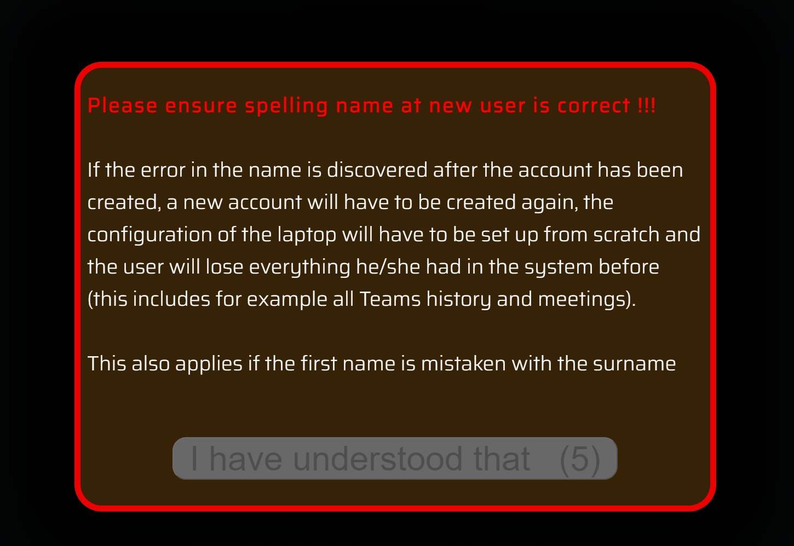
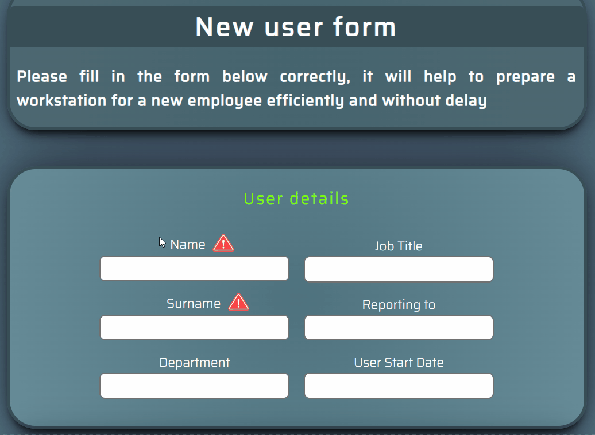
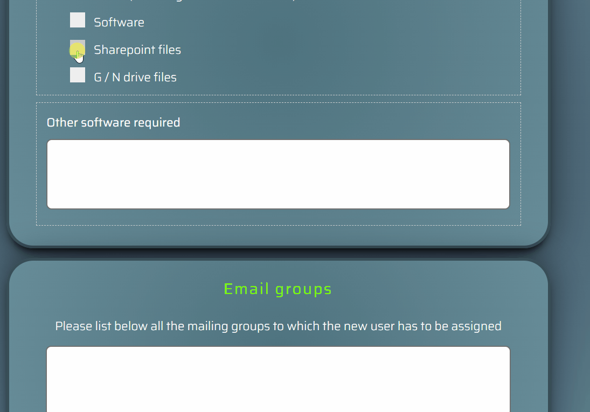
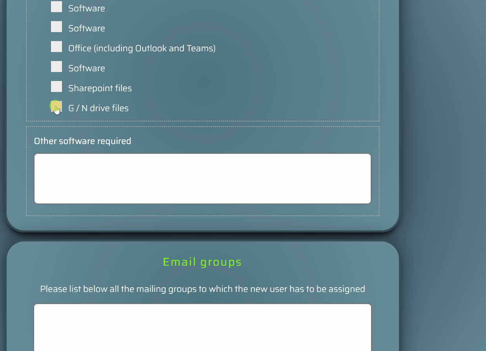

# New user form
This is a form that is filled out before a new employee joins the company.
After its completion, a JSON file is generated, basing on which, the IT department creates all necessary accounts, grants access to company resources and orders the necessary equipment.

# Background
While creating accounts for new employees I continually encountered two problems. First, the person requesting the creation of a new account usually said: "Please create a new account for person X," without giving any details, e.g., who will be the supervisor, what applications the person should have access to, whether there are any special requirements for hardware, etc. And secondly, and most importantly, because of hiring a very large number of people from different countries, very often there were mistakes with the name - the last name was stated as the first name, and the first name as the last name.  
To prevent further mistakes and speed up the work of the IT department, I prepared a simple and quick to fill out a form that contained all the data that the IT department needs to create a account for a new employee. The person filling out the form at the end received a JSON file, which was then attached to the ticket for the IT department.  
:heavy_check_mark: **After implementing this form, there was never again a mistake with the name**

# Features
- The form has a login page
  - The page connects to the domain controller so the user can log into the form using his standard account. The name of the person filling out the form is then also visible on the form itself and is saved to a JSON file as well.  
  
- The form uses the SweetAlert2 library to turn standard popup dialog into responsive and more pleasant popups  
https://sweetalert2.github.io

- I used FileSavers.js extension to save the file as a JSON format  
https://github.com/eligrey/FileSaver.js/tree/master

- Inside you will also find a directory with a page where you can easily read the contents of the JSON file you saved.

# How to use

To use my form you need to:  
- update the form with items that are relevant to you in the index.php file
- modify the main.js file based on the above to export the correct JSON file
- modify the index.html and main.js files in the json reader directory if you want to use it, or use any of the general software to read JSON files  

The last most important part is the login page. Here you have two options:  
1. modify the connect.php file to connect to your domain
2. remove the need to log in at all
    - delete the connect.php and index.php files
    - in file form.php remove php header  
    ```PHP
    <?php
	session_start();
	if (!isset($_SESSION['logged']))
	{
		header('Location: index.php');
		exit();
	}
    ?>
    ```
    - remove the logout button
    - when you run the form, it will show an empty value in the field that shows who is currently logged in - you can leave it like that or remove this field from the form and from the JSON file

# Screenshots

**Animated border at login page**  

  
  
**Entire form**  


**Warning after login**  



**Warning at the form**  



**Custom inputs**  


**Expandable form**  



**Custom tooltip**  


